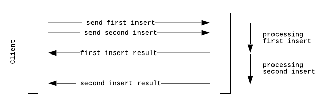
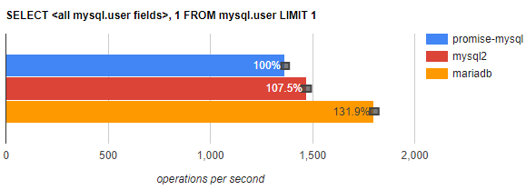

<p align="center">
  <a href="http://mariadb.com/">
    
  </a>
</p>

# MariaDB Node.js connector

[![npm package][npm-image]][npm-url] 
[![Linux Build][travis-image]][travis-url]
[![Windows status][appveyor-image]][appveyor-url]
[![License (LGPL version 2.1)][licence-image]][licence-url]
[![codecov][codecov-image]][codecov-url]

**Non-blocking MariaDB and MySQL client for Node.js.**

MariaDB and MySQL client, 100% JavaScript, with TypeScript definition, compatible with Node.js 6+, with the Promise API.


## Documentation

See [promise documentation](https://github.com/MariaDB/mariadb-connector-nodejs/blob/master/documentation/promise-api.md) for detailed API. 

[Callback documentation](https://github.com/MariaDB/mariadb-connector-nodejs/blob/master/documentation/callback-api.md) describe the callback wrapper for compatibility with existing drivers.
   
## Why a New Client?

While there are existing MySQL clients that work with MariaDB, (such as the [`mysql`](https://www.npmjs.com/package/mysql) and [`mysql2`](https://www.npmjs.com/package/mysql2) clients), the MariaDB Node.js Connector offers new functionality, like [Insert Streaming](#insert-streaming), [Pipelining](#pipelining), [ed25519 plugin authentication](https://mariadb.org/history-of-mysql-mariadb-authentication-protocols/) while making no compromises on performance.


### Insert Streaming 

Using a Readable stream in your application, you can stream `INSERT` statements to MariaDB through the Connector.

```javascript
    
    https.get('https://someContent', readableStream => {
        //readableStream implement Readable, driver will stream data to database 
        connection.query("INSERT INTO myTable VALUE (?)", [readableStream]);
    });
```
 
### Pipelining

With Pipelining, the Connector sends commands without waiting for server results, preserving order.  For instance, consider the use of executing two `INSERT`  statements.

<p align="center">
    
</p>

The Connector doesn't wait for query results before sending the next `INSERT` statement. Instead, it sends queries one after the other, avoiding much of the network latency.

For more information, see the [Pipelining](/documentation/pipelining.md) documentation.
 
### Bulk insert

Some use cases require a large amount of data to be inserted into a database table. By using batch processing, these queries can be sent to the database in one call, thus improving performance.

For more information, see the [Batch](/documentation/batch.md) documentation.


## Benchmarks

MariaDB provides benchmarks comparing the Connector with popular Node.js MySQL clients, including: 

* [`promise-mysql`](https://www.npmjs.com/package/promise-mysql) version 4.0.4 + [`mysql`](https://www.npmjs.com/package/mysql) version 2.17.1 
* [`mysql2`](https://www.npmjs.com/package/mysql2) version 1.6.5

```
promise-mysql  : 646 ops/sec ±2.20%
mysql2         : 746 ops/sec ±2.35%
mariadb        : 961 ops/sec ±2.82%
```

query: **SELECT &lt; all mysql fields &gt;, 1 FROM mysql.user LIMIT 1**



For more information, see the [Benchmarks](/documentation/benchmarks.md) page.

## Quick Start

The MariaDB Connector is available through the Node.js repositories.  You can install it using npm :

```
$ npm install mariadb
```

Using ECMAScript < 2017:

```js
const mariadb = require('mariadb');
const pool = mariadb.createPool({host: process.env.DB_HOST, user: process.env.DB_USER, connectionLimit: 5});
pool.getConnection()
    .then(conn => {
    
      conn.query("SELECT 1 as val")
        .then(rows => { // rows: [ {val: 1}, meta: ... ]
          return conn.query("INSERT INTO myTable value (?, ?)", [1, "mariadb"]);
        })
        .then(res => { // res: { affectedRows: 1, insertId: 1, warningStatus: 0 }
          conn.release(); // release to pool
        })
        .catch(err => {
          conn.release(); // release to pool
        })
        
    }).catch(err => {
      //not connected
    });
```

Using ECMAScript 2017:

```js
const mariadb = require('mariadb');
const pool = mariadb.createPool({host: process.env.DB_HOST, user: process.env.DB_USER, connectionLimit: 5});

async function asyncFunction() {
  let conn;
  try {

	conn = await pool.getConnection();
	const rows = await conn.query("SELECT 1 as val");
	// rows: [ {val: 1}, meta: ... ]

	const res = await conn.query("INSERT INTO myTable value (?, ?)", [1, "mariadb"]);
	// res: { affectedRows: 1, insertId: 1, warningStatus: 0 }

  } catch (err) {
	throw err;
  } finally {
	if (conn) conn.release(); //release to pool
  }
}
```

## Contributing 

If you would like to contribute to the MariaDB Node.js Connector, please follow the instructions given in the [Developers Guide.](/documentation/developers-guide.md)

To file an issue or follow the development, see [JIRA](https://jira.mariadb.org/projects/CONJS/issues/).


[travis-image]:https://travis-ci.org/MariaDB/mariadb-connector-nodejs.svg?branch=master
[travis-url]:https://travis-ci.org/MariaDB/mariadb-connector-nodejs
[npm-image]:https://img.shields.io/npm/v/mariadb.svg
[npm-url]:http://npmjs.org/package/mariadb
[appveyor-image]:https://ci.appveyor.com/api/projects/status/bcg7yy4iy9viq08t/branch/master?svg=true
[appveyor-url]:https://ci.appveyor.com/project/rusher/mariadb-connector-nodejs
[licence-image]:https://img.shields.io/badge/license-GNU%20LGPL%20version%202.1-green.svg?style=flat-square
[licence-url]:http://opensource.org/licenses/LGPL-2.1
[codecov-image]:https://codecov.io/gh/MariaDB/mariadb-connector-nodejs/branch/master/graph/badge.svg
[codecov-url]:https://codecov.io/gh/MariaDB/mariadb-connector-nodejs