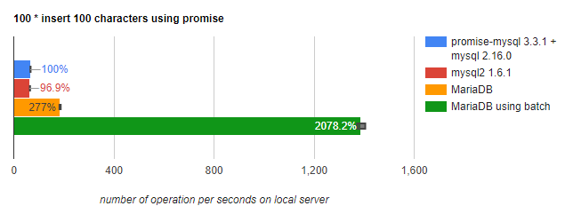

# Batching

Batch processing groups multiple queries into one unit and passes it in a single network trip to a database.
There is different implementation according to server type and version. 

## Using Batching

Some use cases require a large amount of data to be inserted into a database table. By using batch processing, these queries can be sent to the database in one call, thus improving performance.

For instance, say you want to create a basket with five items.

```javascript
connection.beginTransaction();
connection.query("INSERT INTO BASKET(customerId) values (?)", [1], (err, res) => {
  //must handle error if any
  const basketId = res.insertId;
  try {
    connection.batch("INSERT INTO basket_item(basketId, itemId) VALUES (?, ?)",[
        [basketId, 100],
        [basketId, 101],
        [basketId, 103],
        [basketId, 104],
        [basketId, 105]
    ]);
    //must handle error if any
    connection.commit();
  } catch (err) {
    connection.rollback();
    //handle error
  }
});
```

### Performance comparison  

Some benchmark to do some 100 inserts with one parameter of 100 characters :
(benchmark source - see [standard insert](benchmarks/benchs/insert_pipelining.js) and [batch insert](benchmarks/benchs/insert_batch.js) )
<p align="center">
    
</p>

### Configuration

There is one thing to pay attention : MySQL / MariaDB servers have a global option [max_allowed_packet](https://mariadb.com/kb/en/library/server-system-variables/#max_allowed_packet) that limit the maximum packet exchange size. 
If connector send more data than these limit, socket will be immediately dropped.  

default server values : 
- since MariaDB 10.2.4 : 16M
- since MariaDB 10.1.7 : 4M
- before MariaDB 10.1.7 : 1M

You can check servers value using query `select @@max_allowed_packet`.

Connection option "maxAllowedPacket" permit to connector to behave accordingly : if maxAllowedPacket is set to 1048576 (=1M),
packet send to server will be split in packet less than 1M to avoid any issue.
